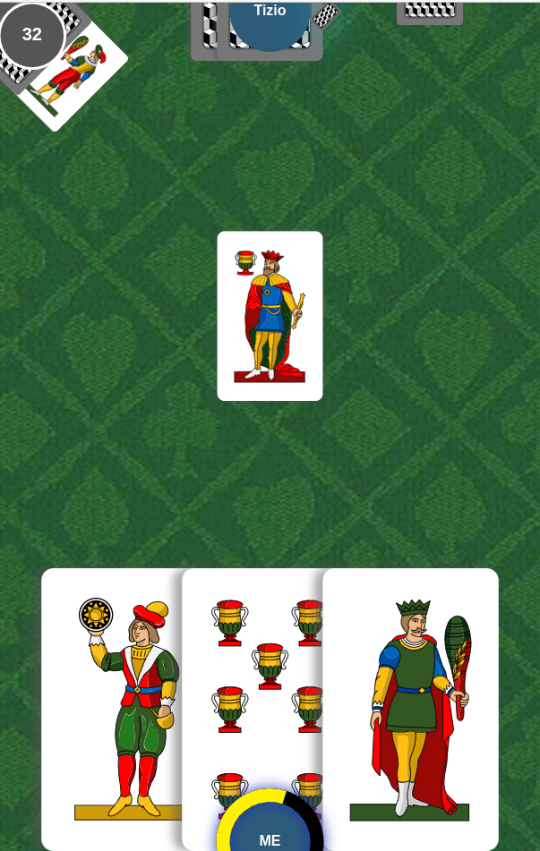
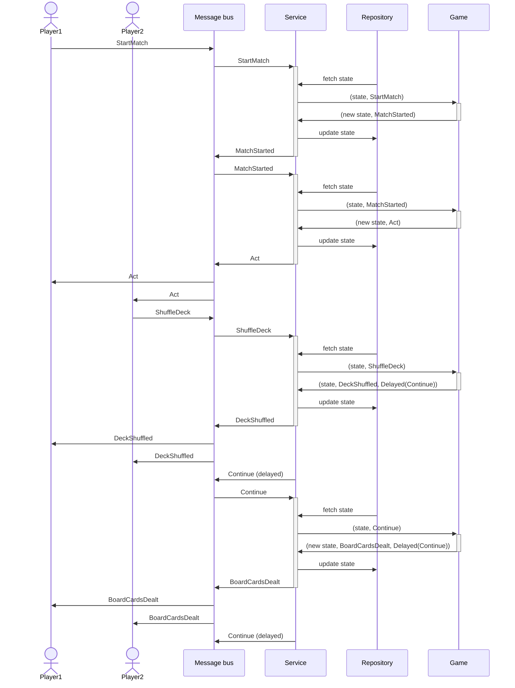

# Bastoni

[](https://app.travis-ci.com/epifab/bastoni)

Classic italian card games service,
including a backend for tressette, briscola and scopa.



## Run

Pre-requisites:

- sbt
- npm

```shell
./run
```

Browse to [localhost:9090](http://localhost:9090)


## Design

This project is based on ideas described by the following articles: 
- [Event driven design for gaming applications](https://www.epifab.solutions/posts/event-driven-design-for-gaming-applications)
- [Scala.js, the good the bad and the ugly](https://www.epifab.solutions/posts/scalajs-the-good-the-bad-and-the-ugly)

Games are implemented as state machines, and defined as a pure, [side-effect-free functions](./modules/domain/src/main/scala/bastoni/domain/logic/GameLogic.scala):

```scala
val play: (State, Event | Command) => (State, List[Event | Command])
```

The [GameService](./modules/domain/src/main/scala/bastoni/domain/logic/GameService.scala) acts as an orchestration layer
performing side effects including:
- storing / retrieving the state of each game
- consuming / publishing to a message bus

The frontend (the player) consumes events and publishes commands to the bus.

The following illustrates how players connect and join a room.


Here is how two players (who previously connected and joined the same room)
can start a new match:



## Technical notes

This project is written in pure functional Scala (Scala 3) and compiles to both JVM and JavaScript.
The entire domain (including business logic for all games) can be run on a browser.

