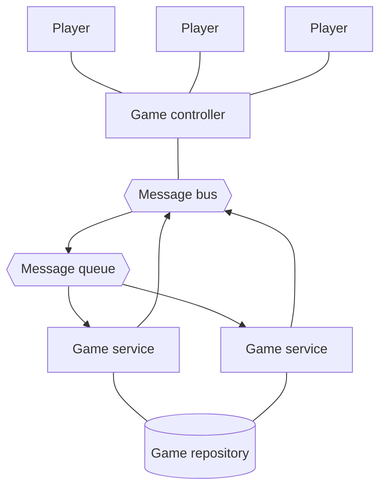
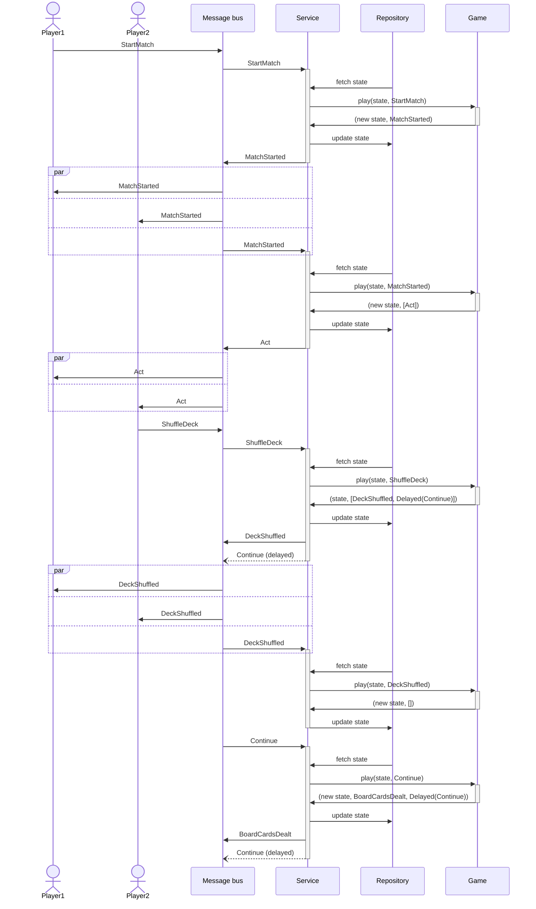

# Bastoni

[](https://app.travis-ci.com/epifab/bastoni)

Gaming platform written in purely functional Scala, supporting italian classic card games: 
[tressette](https://en.wikipedia.org/wiki/Tressette), 
[briscola](https://en.wikipedia.org/wiki/Briscola) 
and [scopa](https://en.wikipedia.org/wiki/Scopa).


## Run

Pre-requisites:

- sbt
- npm

```shell
./run
```

Browse to [localhost:9090](http://localhost:9090)


## Design

This project is based on ideas described by the following articles: 
- [Event driven design for gaming applications](https://www.epifab.solutions/posts/event-driven-design-for-gaming-applications)
- [Scala.js, the good the bad and the ugly](https://www.epifab.solutions/posts/scalajs-the-good-the-bad-and-the-ugly)

### Architecture

The architecture is fully event-driven and designed to specifically address resilience and scalability.

Remote players connect and communicate to the service exclusively through a Game controller.
The Game controller is in charge of forwarding remote players' messages to a message bus
and also consuming, transforming and forwarding messages from that same bus back to the remote player.

The game service (responsible for handling games logic) publishes to the same bus,
but consumes messages from a queue, allowing multiple instances to run simultaneously for scalability.



Internally, the game service implements games as state machines.  
Each game is defined as a pure, [side-effect-free function](./modules/domain/src/main/scala/bastoni/domain/logic/GameLogic.scala):

```scala
val play: (State, Event | Command) => (State, List[Event | Command])
```

All side effects are performed by the game service, including:
- storing / retrieving the state of each game
- consuming messages from the queue
- publishing messages to the bus

The following diagram illustrates how players connect and join a room.
Please note that the Game controller and the message queue are omitted
for the sake of simplicity:


The following diagram illustrates how two players (in the same room) can start playing together.  
Again, some components have been omitted for simplicity:



### More in details

This project is _not_ (and might never become) production-ready.
It is indeed purely experimental, so feel free to draw inspiration from it, and use it at your own risk.

Please note that due to the experimental nature of this service,
all pieces of infrastructure (repository, message bus and message queue) have in-memory implementations only,
relying on cats effect and fs2.
